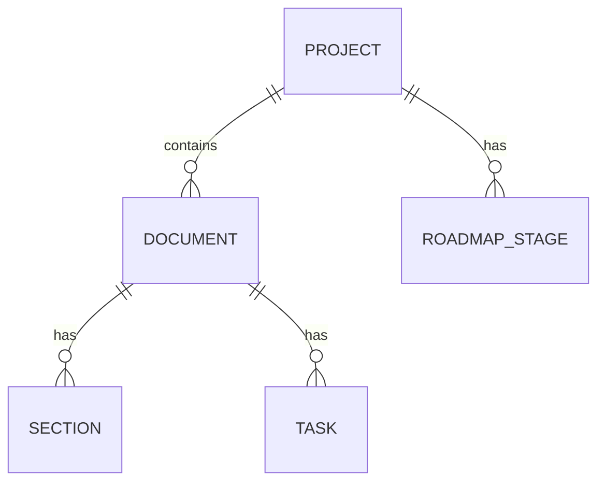

# 数据模型（Data Model）📐

superpowers-c456-dashboard 的数据契约。多视图查看，从总览视觉到蚂蚁视觉。

## 导航

| 文件 | 内容 | 视角 |
|------|------|------|
| `schema.md` | 当前数据模型（ER 图 + 字段表 + JSON 契约 + 类型/状态枚举） | 总览 → 蚂蚁 |
| `er.mmd` | mermaid ER 图源文件 | 总览（实体关系）|
| `changelog.md` | 数据模型变更记录 | 演进（历史）|

## 规范：写设计时同步维护数据模型

> **任何功能设计（spec）涉及数据模型变更时，须同步更新 `docs/models/schema.md`**。
> 各设计文档里的模型是过程稿，`schema.md` 是唯一最终版。
> 变更后在 `changelog.md` 记一条。

## ER 图速览

