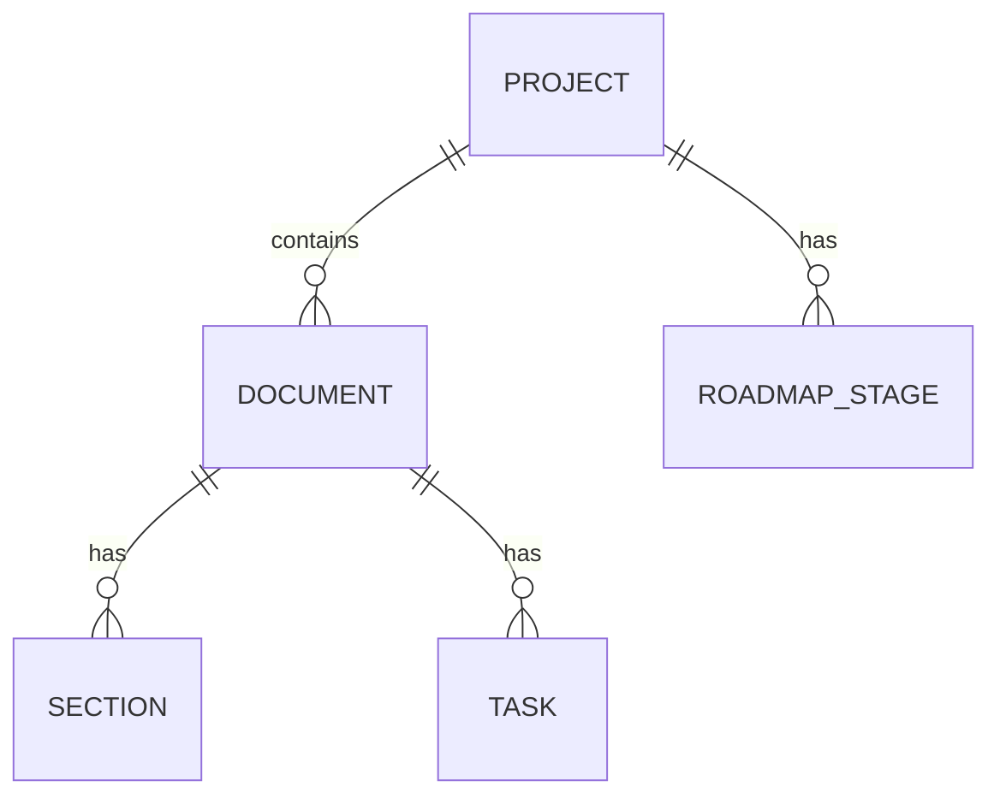

# 数据模型（Schema）

> superpowers-c456-dashboard 的数据契约总览。从 ER 图（总览）到字段级（蚂蚁）多视图查看。
> 变更记录见 `changelog.md`；ER 图源文件 `er.mmd`。

## L1 · ER 图（实体关系总览）



## L2 · 字段表（结构）

### Project

| 字段 | 类型 | 说明 |
|------|------|------|
| name | string | 项目名 |
| root | string | 项目根目录绝对路径 |
| type | string | 项目类型（产品/工具 等） |
| status | string | 项目状态（开发中/已上线 等） |
| stats | Stats | 统计（见下） |
| documents | Document[] | 文档列表 |
| roadmap_stages | RoadmapStage[] | 路线图阶段 |

### Stats

| 字段 | 类型 | 说明 |
|------|------|------|
| total_docs | int | 文档总数 |
| tasks_total | int | 任务总数 |
| tasks_done | int | 已完成任务数 |
| completion | int | 完成百分比 |

### Document

| 字段 | 类型 | 说明 |
|------|------|------|
| path | string | 相对路径 |
| title | string | 标题 |
| date | string | 日期 |
| type | string | 文档类型（枚举见 L4） |
| status | string | 状态（原始文本，前端归一化展示） |
| summary | string | 摘要 |
| sections | Section[] | 章节 |
| tasks | Task[] | 任务（checkbox） |
| content | string | 全文 |
| meta | map | frontmatter/引用块元数据键值 |

## L3 · JSON 契约实测样例

`GET /data` 返回（节选）：
```json
{
  "projects": [
    {
      "name": "athena",
      "root": "/Users/xiaohui/Codes/athena",
      "stats": { "total_docs": 45, "tasks_done": 27, "tasks_total": 187, "completion": 14 },
      "documents": [
        { "path": "docs/specs/2026-08-16-asset-import.md", "title": "...", "type": "spec",
          "status": "approved", "tasks": [ { "text": "实现", "done": false } ] }
      ],
      "roadmap_stages": [ { "id": "1", "title": "地基", "desc": "..." } ]
    }
  ],
  "total_projects": 6,
  "global_tasks_total": 493, "global_tasks_done": 113, "global_completion": 22, "global_docs_total": 458
}
```

## L4 · 文档类型枚举与状态（蚂蚁级明细）

### doc.type 枚举（8 阶段工作流）

| type | 中文标签 | 英文目录 | 判定要点 |
|------|---------|---------|---------|
| requirement | 客户需求 | `requirements/` | `/requirements/` 或标题含「需求」「需求规格」「客户需求」 |
| research | 调研 | `research/` | `/research/` 或标题含「调研」「探测」 |
| story | 用户故事 | `stories/` | `/stories/` 或标题含「用户故事」「story」 |
| product | 产品设计 | `product/` | `/product/` 或标题含「产品设计」「信息架构」「交互设计」「UX」 |
| spec | 功能设计 | `specs/` | `/specs/` 或标题含「设计」(非实现)、「架构」 |
| roadmap | 路线图 | `roadmap/` | 标题含「路线图」「roadmap」 |
| plan | 开发计划 | `plans/` | 标题含「实现计划」「开发计划」 |
| sprint | 冲刺 | `sprints/` | 标题含「冲刺」「sprint」 |
| doc | 文档 | — | 其余 |

判定顺序（优先级）：roadmap → sprint → requirement → research → story → product → spec → plan → doc

### 状态归一化（前端 STATUS_META）

| 规范状态 | 匹配原文（含） | emoji | 色 |
|---------|--------------|-------|-----|
| 已批准 | approved / 正式方案 / 已验证 / 已定稿 / 已批准 | ✅ | green |
| 草稿 | draft / 未验证 / 未定稿 / 草案 / 草稿 | 🔶 | amber |
| 提案 | 提案 / proposal | 💡 | blue |
| 已废弃 | 废弃 / deprecated / 已删除 / 已作废 | 🗑️ | gray |
| 评审中 | 评审中 / review | 🔄 | blue |
| 其他 | 其余 | 📄 | neutral |
